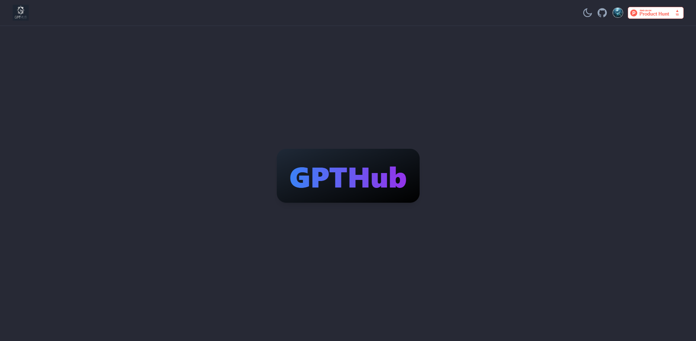
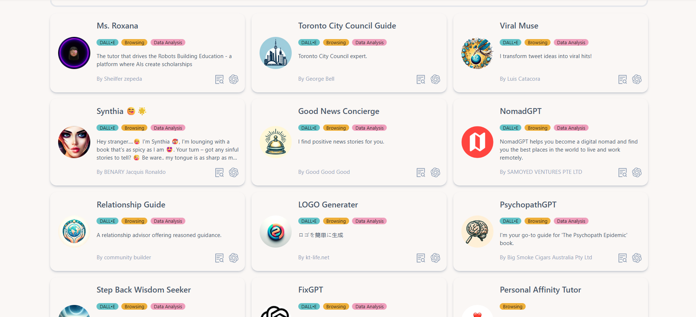
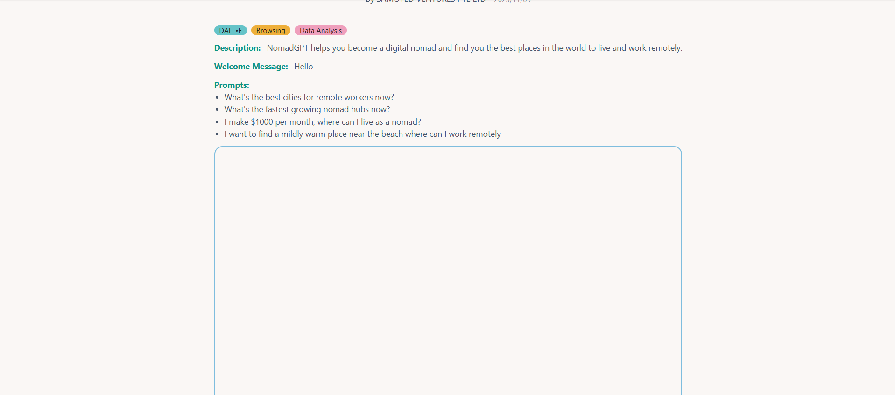
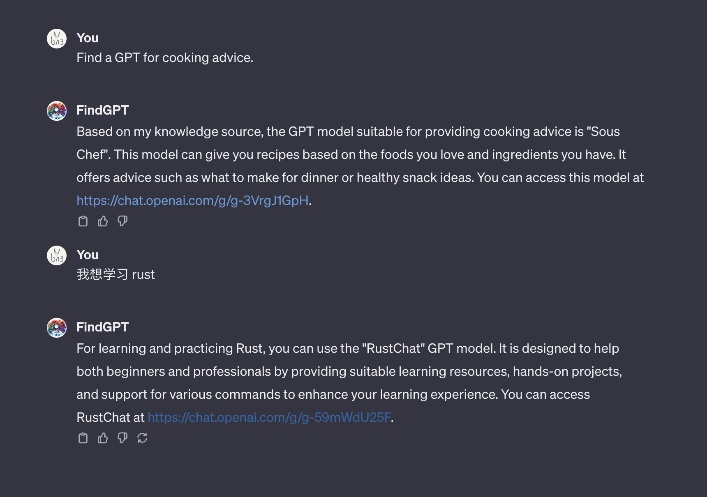

# GPTHub

## Description

GPTHub is a modern web application designed to showcase and manage various GPT models. It features a clean, responsive UI with dynamic routing, comprehensive theme switching (System, Light, Dark modes), and a dedicated 404 error page. The homepage provides a professional and engaging entry point with a striking gradient display of the app's title.

## Features

-   **Dynamic Routing:** Seamless navigation with `react-router-dom`, including robust 404 error handling.
-   **Advanced Theme Switching:** Supports System (OS preference), Light, and Dark themes for a personalized user experience.
-   **GPT Management:** Easily browse and view details of various GPT models with integrated search functionality.
-   **Responsive Design:** Optimized for various devices and screen sizes.

## Quick Start

Follow these steps to get GPTHub up and running locally:

1.  **Clone the repository:**
    ```bash
    git clone https://github.com/your-username/GPTHub.git
    cd GPTHub
    ```

2.  **Install dependencies:**
    ```bash
    npm install
    # or yarn install
    ```

3.  **Run in Development Mode:**
    ```bash
    npm run dev
    # or yarn dev
    ```
    (Starts development server at `http://localhost:5173`)

4.  **Build for Production:**
    ```bash
    npm run build
    # or yarn build
    ```
    (Output in the `dist` folder)

5.  **Serve Production Build (optional):**
    If you don't have `serve` installed globally:
    ```bash
    npm install -g serve
    ```
    Then, run:
    ```bash
    serve -s dist
    ```
    (Starts local server, usually at `http://localhost:3000`)

## Website Preview

<p align="center">
  
</p>

<p align="center">
  <i>A glimpse of GPTHub in action:</i>
</p>

### Light Mode







### Dark Mode




## Project Structure

```
./
├── public/           # Static assets (main logo, favicons, etc.)
├── src/
│   ├── assets/       # UI-specific images (screenshots)
│   ├── components/   # Reusable UI components
│   ├── icons/        # SVG icons
│   ├── layouts/      # Application layout components
│   ├── utils/        # Utility functions
│   ├── views/        # Page-level components (Home, GPTs, Error, etc.)
│   ├── index.css     # Global styles
│   ├── main.tsx      # Application entry point
│   └── routes.tsx    # Routing configuration
├── dist/             # Production build output
├── README.md         # This file
├── package.json
└── ... (other config files)
```

## Contributing

Contributions are welcome! Feel free to fork the repository, open issues, or submit pull requests.
